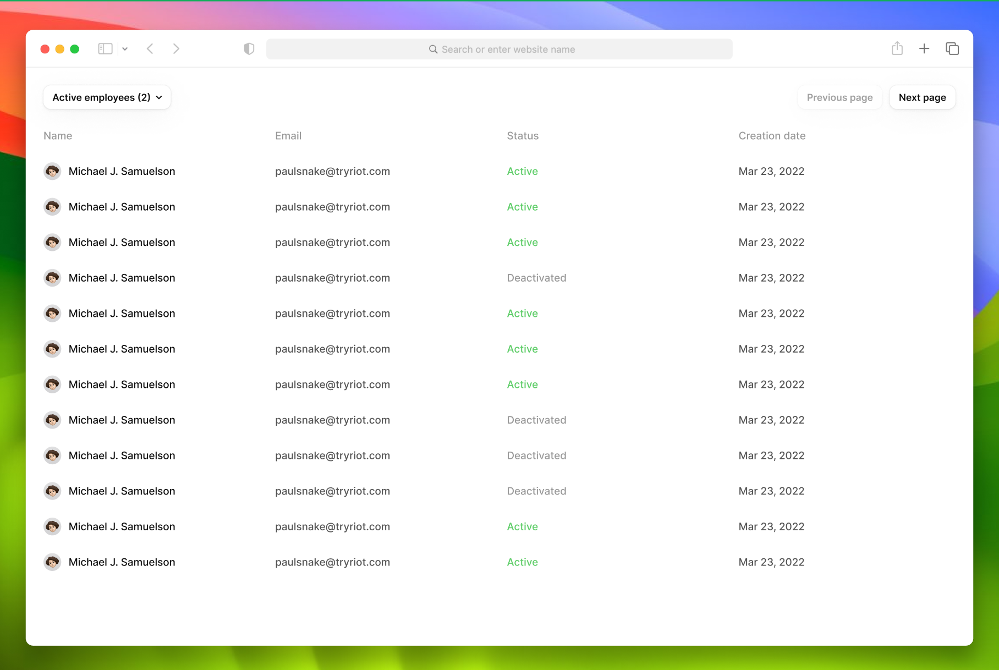

# Frontend Challenge

# Exercice: Employees table

At Riot we often have to display data as tables so the most accurate exercice for you will be to implement your own !

In this exercice you will have to implement a table like one we have in the platform: The table showing the employees of a workspace.

Link to the figma: https://www.figma.com/design/6moqNUsi9U3oeDxqVEgibV/Front-end-test?node-id=0-1&p=f

## Specs

- The table **must respect the design** given: https://www.figma.com/design/6moqNUsi9U3oeDxqVEgibV/Front-end-test?node-id=0-1&p=f

- **The employees can be filtered** by the select on the top-left.
  - If I select Active employees, I must see only active employees in the table
  - If I select Deactivated employees, I must see only deactivated employees in the table
  - If I select all, I must see all employees in the table
  - By default, `all` is selected

We will pay a lot of attention to the way you structure the components! You should have at least several components, but you can create as much as you want.

Note: Usage of tailwind and typescript is recommended but not mandatory.

## Boilerplate

The repository contains a boilerplate to help you get started. It includes:

- A Vue3 app with Vite with an empty EmployeesTable component: This is where you will work!
- A tailwind config: This is a sample of our own design system configuration so you can get a preview of how we work! It will help you with the colors, text and spacing naming you find on figma. You can add more element inside it if you want.
- A `server` folder: see after

## Data Fetching

For the sake of simplicity of this exercice, we provide you a small server that will return you the employees from a HTTP endpoint.

By default the server will run on port 9000 and it exposes a single endpoint: `/employees` that will return you _all_ the employees. This means that you will do the filtering on the frontend side.

## Get Started

- clone this repository
- run `pnpm` then:
  - run `pnpm dev` to launch the vite dev server
  - run `pnpm server:start` to launch the server
- Start coding !

If you have any question or if something is not clear, do not hesitate to ask!
